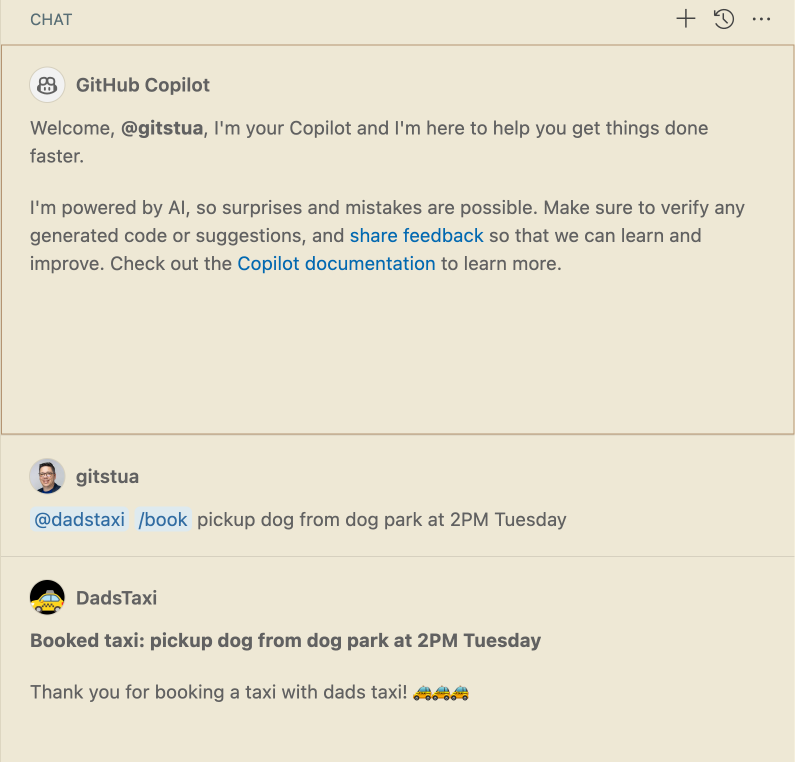
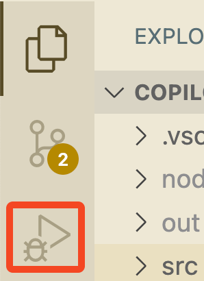

# Dadstaxi Copilot Chat Example

Visual Studio Code's Copilot Chat architecture enables extension authors to integrate with the GitHub Copilot Chat experience. A chat extension is a VS Code extension that uses the Chat extension API by contributing a Chat participant. Chat participants are domain experts that can answer user queries within a specific domain.

The Language Model API enables you to use the Language Model and integrate AI-powered features and natural language processing in your Visual Studio Code extension.

When an extension uses the Chat or the Language Model API, we call it a GitHub Copilot Extension, since GitHub Copilot is the provider of the Chat and the Language Model experience.

This GitHub Copilot Extension sample shows:

- How to contribute a chat participant to the GitHub Copilot Chat view.
- How to return static responses to user queries.
- How to use the Language Model API to request access to the Language Model (gpt-4o, gpt-3.5-turbo, gpt-4).

Related documentation for the demo this is based on can be found here:
- https://code.visualstudio.com/api/extension-guides/chat
- https://code.visualstudio.com/api/extension-guides/language-model

## Installation
You can install this as an extension in VSCode from the marketplace - [StuartEggerton.dadstaxi-chat-sample](https://marketplace.visualstudio.com/items?itemName=StuartEggerton.dadstaxi-chat-sample)

# Developers
If you install this from the marketplace you can ignore this section. This is the inner loop for how you would develop an extension like this...

## Running the Sample

- Run `npm install` in terminal to install dependencies
- Run the `Run Extension` target in the Debug View. This will:
	- Start a task `npm: watch` to compile the code
	- Run the extension in a new VS Code window
	- You will see the @dadstaxi chat participant show in the GitHub Copilot Chat view

